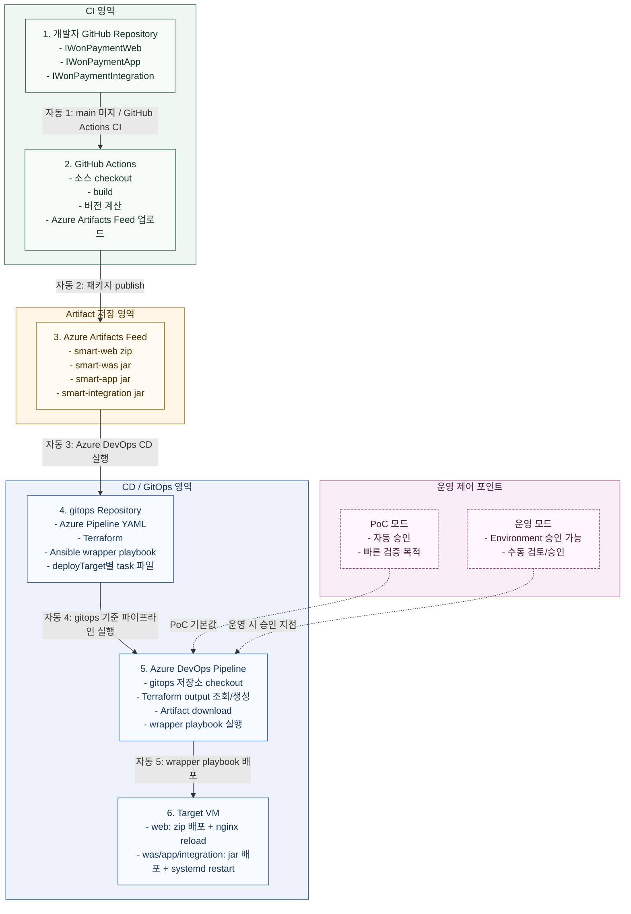

# GitHub & Azure DevOps 하이브리드 CI/CD 구성 방안

본 문서는 GitHub를 소스 저장소(CI)로 사용하고 Azure DevOps를 배포 엔진(CD)으로 활용하는 하이브리드 구성 방안을 정리합니다. 
현재 기준 저장소 구조는 Web/WAS가 단일 저장소(IWonPaymentWeb) 내 폴더로 분리되어 있고, App/Integration은 별도 저장소로 운영됩니다.

---

## 0. 본 문서의 적용 범위 (PoC 예외 포함)

현재 단계는 PoC이므로 아래 2개 항목은 의도적으로 예외 처리합니다.

- 예외 1: CI에서 테스트를 생략하고 빠른 배포를 허용한다.
- 예외 2: 보안 권한 범위(예: PAT, Secure File 접근)는 PoC 속도를 위해 운영 기준보다 완화할 수 있다.

위 2개를 제외한 나머지(버전 전략, 배포 분리, 아티팩트 검증, 환경 승인 정책, 문서 정합성)는 본 문서에서 운영 적용 가능한 수준으로 보완합니다.

---

## 1. 전체 아키텍처 (Architecture)

시스템별 책임이 분리되어 있으므로, 소스 빌드 및 업로드(GitHub)와 인프라 배포/애플리케이션 배포(Azure DevOps)의 역할을 분리하는 것이 핵심입니다.

- GitHub(CI): IWonPaymentWeb 저장소의 web/was 폴더, IWonPaymentApp 저장소, IWonPaymentIntegration 저장소에서 소스를 빌드하고 결과물(JAR/Zip)을 Azure Artifacts로 업로드합니다.
- Azure DevOps(CD): 파이프라인을 인프라(Terraform)와 애플리케이션(Ansible) 단계로 분리해 실행합니다.

### 1.1 전체 흐름도

개발자 리포지토리에는 애플리케이션 소스만 두고, 배포 정의(YAML/Ansible/Terraform)는 gitops 리포지토리에서 중앙 관리합니다.



### 1.2 저장소 역할 분담

1. 개발자 리포지토리
- 역할: 애플리케이션 소스 관리, 빌드, 패키징
- 포함 파일: application source, build.gradle, GitHub Actions workflow
- 비포함 원칙: 운영 배포용 Ansible/Terraform/YAML
- 구조 메모: IWonPaymentWeb는 단일 저장소 내 web/was 폴더를 각각 독립 배포 단위로 관리

2. Artifacts Feed
- 역할: 빌드 산출물의 버전 저장소
- Azure DevOps CD는 GitHub 소스를 직접 배포하지 않고, Feed에 올라온 버전 산출물을 기준으로 배포

3. gitops 리포지토리
- 역할: 배포 정의 중앙 관리
- 포함 파일: Azure DevOps 파이프라인, Terraform, inventory 생성 스크립트, Ansible wrapper/task
- 실제 배포 기준 파일:
  - gitops/ansible/azure-pipelines-vm.yml
  - gitops/ansible/deploy-playbook.yml
  - gitops/ansible/tasks/deploy-web.yml
  - gitops/ansible/tasks/deploy-was.yml
  - gitops/ansible/tasks/deploy-app.yml
  - gitops/ansible/tasks/deploy-integration.yml

---

## 2. GitHub CI 설정 (소스 빌드 및 Artifact 발행)

### 2.1 개발 환경 및 빌드 원칙

- Cloud Build 방식: 개발자의 로컬(VS Code) 환경이 아닌 GitHub Runner에서 빌드를 수행합니다.
- 이유: 환경 일관성 유지(Java 버전 통일), 로컬 설정 유입 차단, 휴먼 에러 방지.

### 2.2 Gradle 설정 (build.gradle)

빌드 결과물을 Azure Artifacts(Maven Feed)로 전송하기 위해 maven-publish 설정을 추가합니다.

핵심 원칙은 최신(latest)/SNAPSHOT 의존을 줄이고, 커밋/빌드번호 기반의 고정 버전을 발행하는 것입니다.

```gradle
publishing {
    publications {
        mavenJava(MavenPublication) {
            from components.java
            groupId = 'com.iteyes.smart'
            artifactId = project.name // 예: smart-was, smart-web
            version = System.getenv("APP_VERSION") ?: "0.0.0-local"
        }
    }
    repositories {
        maven {
            url 'https://pkgs.dev.azure.com/{Org}/{Project}/_packaging/{Feed}/maven/v1'
            credentials {
                username = "AZURE_DEVOPS_PAT"
                password = System.getenv("AZURE_ARTIFACTS_ENV_ACCESS_TOKEN")
            }
        }
    }
}
```

권장 버전 예시:

- 1.4.2+build.381
- 1.4.2-main.7c2d9a1

### 2.3 GitHub Actions 워크플로우 (.github/workflows/ci-cd.yml)

main 브랜치 반영 시 자동 실행되어 배포 단위별 산출물을 생성 후 Azure Artifacts에 업로드합니다.

Web/WAS는 하나의 저장소(IWonPaymentWeb) 안에서 폴더가 분리되어 있으므로, 자동배포 시작 파일도 폴더 기준으로 2개를 둡니다.

- deploy-web.yml: IWonPaymentWeb/web 폴더 변경 시 web 산출물 생성 및 web 배포 호출
- deploy-was.yml: IWonPaymentWeb/was 폴더 변경 시 was 산출물 생성 및 was 배포 호출
- App/Integration은 기존처럼 저장소별 1개 파일 구성

```yaml
name: Java CI with Gradle and Publish to Azure Artifacts

on:
  push:
    branches: [ "main" ]

jobs:
  build-and-publish:
    runs-on: ubuntu-latest
    permissions:
      contents: read

    steps:
    - name: Checkout Source Code
      uses: actions/checkout@v4

    - name: Set up JDK 17
      uses: actions/setup-java@v4
      with:
        java-version: '17'
        distribution: 'temurin'

    - name: Compute immutable version
      run: |
        SHORT_SHA=$(echo "${GITHUB_SHA}" | cut -c1-7)
        echo "APP_VERSION=1.0.0-main.${SHORT_SHA}" >> $GITHUB_ENV

    - name: Build with Gradle (PoC: tests skipped intentionally)
      run: chmod +x gradlew && ./gradlew build -x test

    - name: Publish to Azure Artifacts
      run: ./gradlew publish
      env:
        APP_VERSION: ${{ env.APP_VERSION }}
        AZURE_ARTIFACTS_ENV_ACCESS_TOKEN: ${{ secrets.AZURE_DEVOPS_PAT }}
```

보안(PoC): Azure DevOps에서 발급받은 PAT(Personal Access Token)을 GitHub Secrets(AZURE_DEVOPS_PAT)에 등록합니다.

### 2.4 자동배포 연결 방식 확정

현재 [gitops/ansible/azure-pipelines-vm.yml](gitops/ansible/azure-pipelines-vm.yml) 은 `trigger: none` 으로 작성되어 있으므로, 자동배포는 파이프라인 내부가 아니라 외부 CI가 실행을 시작하는 방식으로 연결해야 합니다.

본 PoC와 현재 구조에서는 아래 1개 방식으로 고정합니다.

- 선택 방식: GitHub Actions 빌드/Feed 업로드 완료 후 Azure DevOps Pipeline Runs REST API 호출
- 선택 이유 1: 현재 CD 기준 파이프라인은 gitops 저장소에 있고, 배포 입력값도 YAML parameter로 이미 정의되어 있어 외부 호출 연결이 가장 단순함
- 선택 이유 2: 실제 배포 기준이 GitHub 소스 변경이 아니라 Feed 업로드 완료 시점이므로, CI 완료 이후 호출이 가장 정합적임
- 선택 이유 3: 현재 [gitops/ansible/azure-pipelines-vm.yml](gitops/ansible/azure-pipelines-vm.yml) 의 parameter 구조를 그대로 사용할 수 있어 추가 개조가 거의 필요 없음

### 2.5 실제 구현안

자동배포 시작 시점은 다음 순서로 고정합니다.

1. 개발자 리포지토리의 GitHub Actions가 `main` 머지 후 빌드를 수행한다.
2. GitHub Actions가 산출물을 Azure Artifacts Feed에 publish 한다.
3. publish 성공 직후 같은 워크플로우에서 Azure DevOps Runs REST API를 호출한다.
4. Azure DevOps가 [gitops/ansible/azure-pipelines-vm.yml](gitops/ansible/azure-pipelines-vm.yml) 을 실행한다.
5. 파이프라인은 Feed에서 방금 publish 된 버전을 다운로드하고 Ansible 배포를 수행한다.

필수 입력값은 아래 4개입니다.

- `ADO_ORG`: `iteyes-ito`
- `ADO_PROJECT`: `iwon-smart-ops`
- `ADO_PIPELINE_ID`: Azure DevOps 배포 파이프라인 ID
- `ADO_PAT`: Azure DevOps REST 호출 가능 PAT

PoC에서는 `ADO_PAT` 하나로 Feed publish 와 Pipeline run 호출을 같이 처리할 수 있습니다. 운영 전환 시에는 publish 용 PAT 와 run 호출용 PAT 를 분리하는 것이 안전합니다.

### 2.6 azure-pipelines-vm.yml 파라미터 매핑

GitHub Actions가 REST API로 넘겨야 하는 값은 현재 YAML parameter 와 아래처럼 1:1로 맞춥니다.

| Azure DevOps parameter | 값 생성 기준 | 예시 |
| --- | --- | --- |
| `runTerraform` | 일반 배포는 `false` 고정 | `false` |
| `deployTarget` | 리포지토리 또는 서비스 종류에 따라 결정 | `was` |
| `artifactFeedName` | 고정 | `iwon-smart-feed` |
| `artifactFeedView` | 현재 기본값 유지 | `""` |
| `mavenPackageDefinition` | 서비스별 패키지 정의 직접 전달 | `com.iteyes.smart:smart-was` |
| `mavenPackageVersion` | GitHub Actions에서 계산한 불변 버전 사용 | `1.0.0-main.7c2d9a1` |
| `artifactPattern` | `web` 는 `*.zip`, 나머지는 `*.jar` | `*.jar` |

서비스별 기본 매핑은 아래와 같습니다.

- `web` -> `mavenPackageDefinition=com.iteyes.smart:smart-web`, `artifactPattern=*.zip`
- `was` -> `mavenPackageDefinition=com.iteyes.smart:smart-was`, `artifactPattern=*.jar`
- `app` -> `mavenPackageDefinition=com.iteyes.smart:smart-app`, `artifactPattern=*.jar`
- `integration` -> `mavenPackageDefinition=com.iteyes.smart:smart-integration`, `artifactPattern=*.jar`

Web/WAS 단일 저장소 규칙:

- IWonPaymentWeb/web 폴더 파이프라인은 `deployTarget=web` 으로만 호출
- IWonPaymentWeb/was 폴더 파이프라인은 `deployTarget=was` 으로만 호출
- 두 파이프라인은 동일 저장소를 보더라도 배포 대상이 섞이지 않도록 분리 유지

### 2.7 GitHub Actions 호출 예시 (IWonPaymentWeb 전용 2개 파일)

IWonPaymentWeb 저장소는 web/was 폴더가 공존하므로, 자동배포 워크플로우를 반드시 2개로 분리합니다.

1. deploy-web.yml (web 폴더 전용)

```yaml
name: Deploy Web Artifact

on:
  push:
    branches: [ "main" ]
    paths:
      - "web/**"

jobs:
  build-publish-trigger:
    runs-on: ubuntu-latest
    permissions:
      contents: read
    env:
      ADO_ORG: iteyes-ito
      ADO_PROJECT: iwon-smart-ops
      ADO_PIPELINE_ID: ${{ secrets.ADO_PIPELINE_ID }}

    steps:
      - name: Checkout
        uses: actions/checkout@v4

      - name: Set up JDK 17
        uses: actions/setup-java@v4
        with:
          java-version: '17'
          distribution: 'temurin'

      - name: Compute immutable version
        run: |
          SHORT_SHA=$(echo "${GITHUB_SHA}" | cut -c1-7)
          echo "APP_VERSION=1.0.0-main.${SHORT_SHA}" >> "$GITHUB_ENV"

      - name: Build web module
        run: chmod +x gradlew && ./gradlew :web:build -x test

      - name: Publish web package
        run: ./gradlew :web:publish
        env:
          APP_VERSION: ${{ env.APP_VERSION }}
          AZURE_ARTIFACTS_ENV_ACCESS_TOKEN: ${{ secrets.ADO_PAT }}

      - name: Trigger Azure DevOps deploy (web)
        env:
          ADO_PAT: ${{ secrets.ADO_PAT }}
        run: |
          set -euo pipefail
          API_URL="https://dev.azure.com/${ADO_ORG}/${ADO_PROJECT}/_apis/pipelines/${ADO_PIPELINE_ID}/runs?api-version=7.1"
          cat > run-pipeline.json <<EOF
          {
            "resources": {
              "repositories": {
                "self": {
                  "refName": "refs/heads/main"
                }
              }
            },
            "templateParameters": {
              "runTerraform": false,
              "deployTarget": "web",
              "artifactFeedName": "iwon-smart-feed",
              "artifactFeedView": "",
              "mavenPackageDefinition": "com.iteyes.smart:smart-web",
              "mavenPackageVersion": "${APP_VERSION}",
              "artifactPattern": "*.zip"
            }
          }
          EOF
          curl --fail --silent --show-error \
            -u ":${ADO_PAT}" \
            -H "Content-Type: application/json" \
            -X POST \
            --data @run-pipeline.json \
            "${API_URL}"
```

2. deploy-was.yml (was 폴더 전용)

```yaml
name: Deploy WAS Artifact

on:
  push:
    branches: [ "main" ]
    paths:
      - "was/**"

jobs:
  build-publish-trigger:
    runs-on: ubuntu-latest
    permissions:
      contents: read
    env:
      ADO_ORG: iteyes-ito
      ADO_PROJECT: iwon-smart-ops
      ADO_PIPELINE_ID: ${{ secrets.ADO_PIPELINE_ID }}

    steps:
      - name: Checkout
        uses: actions/checkout@v4

      - name: Set up JDK 17
        uses: actions/setup-java@v4
        with:
          java-version: '17'
          distribution: 'temurin'

      - name: Compute immutable version
        run: |
          SHORT_SHA=$(echo "${GITHUB_SHA}" | cut -c1-7)
          echo "APP_VERSION=1.0.0-main.${SHORT_SHA}" >> "$GITHUB_ENV"

      - name: Build was module
        run: chmod +x gradlew && ./gradlew :was:build -x test

      - name: Publish was package
        run: ./gradlew :was:publish
        env:
          APP_VERSION: ${{ env.APP_VERSION }}
          AZURE_ARTIFACTS_ENV_ACCESS_TOKEN: ${{ secrets.ADO_PAT }}

      - name: Trigger Azure DevOps deploy (was)
        env:
          ADO_PAT: ${{ secrets.ADO_PAT }}
        run: |
          set -euo pipefail
          API_URL="https://dev.azure.com/${ADO_ORG}/${ADO_PROJECT}/_apis/pipelines/${ADO_PIPELINE_ID}/runs?api-version=7.1"
          cat > run-pipeline.json <<EOF
          {
            "resources": {
              "repositories": {
                "self": {
                  "refName": "refs/heads/main"
                }
              }
            },
            "templateParameters": {
              "runTerraform": false,
              "deployTarget": "was",
              "artifactFeedName": "iwon-smart-feed",
              "artifactFeedView": "",
              "mavenPackageDefinition": "com.iteyes.smart:smart-was",
              "mavenPackageVersion": "${APP_VERSION}",
              "artifactPattern": "*.jar"
            }
          }
          EOF
          curl --fail --silent --show-error \
            -u ":${ADO_PAT}" \
            -H "Content-Type: application/json" \
            -X POST \
            --data @run-pipeline.json \
            "${API_URL}"
```

적용 포인트는 아래와 같습니다.

- GitHub Actions 는 source repo 에 존재한다.
- Azure DevOps 배포 YAML 은 gitops repo 에 존재한다.
- 두 저장소를 직접 합치지 않고, REST API 호출만으로 CD 시작을 연결한다.
- `mavenPackageVersion` 은 반드시 `latest` 가 아니라 방금 publish 한 `APP_VERSION` 값을 넘긴다.
- `deployTarget` 은 저장소별로 고정하거나 GitHub repository 변수로 분기할 수 있다.

### 2.8 권장 운영 규칙

현재 PoC에서 바로 적용할 운영 규칙은 아래로 정리합니다.

- [gitops/ansible/azure-pipelines-vm.yml](gitops/ansible/azure-pipelines-vm.yml) 의 `trigger: none` 은 유지한다.
- 자동배포 시작 책임은 GitHub Actions 가 가진다.
- Azure DevOps 는 배포 엔진으로만 동작한다.
- `mavenPackageVersion` 은 immutable version 을 사용한다.
- `runTerraform` 은 일반 애플리케이션 배포 시 `false` 를 기본값으로 사용한다.

이렇게 고정하면 현재 gitops 구조를 유지하면서도, 개발자 `main` 머지부터 Feed publish, Azure DevOps 실행, VM 배포까지 한 흐름으로 자동 연결할 수 있습니다.

---

## 3. Azure DevOps CD 설정 (배포 엔진)

이 파이프라인의 핵심은 GitHub Actions가 Artifacts Feed에 업로드한 JAR를 받아 Terraform으로 인프라 상태를 확인하고, Ansible로 VM에 실배포하는 것입니다.

### 3.1 CD 파이프라인 전체 흐름 (CD Workflow)

1. Trigger: GitHub Actions가 Feed publish 성공 직후 Azure DevOps Runs REST API를 호출해 파이프라인을 실행합니다. PoC에서는 필요 시 수동 실행도 허용합니다.
2. Artifact Download: 피드에서 배포 대상(Web/WAS/App/Integration)에 맞는 JAR를 다운로드합니다.
3. Infrastructure Check(Terraform): 배포 대상 VM 인벤토리/네트워크 상태를 점검합니다.
4. Application Deploy(Ansible): VM에 접속해 기존 프로세스를 종료하고 새 JAR를 배포한 뒤 재기동합니다.

### 3.2 CD 파이프라인 샘플 (azure-pipelines-cd.yml)

아래 예시는 이사님 요청 구조를 기준으로 시스템별 분기 배포가 가능하도록 정리한 샘플입니다.

실제 저장소 반영 파일: [gitops/ansible/azure-pipelines-vm.yml](gitops/ansible/azure-pipelines-vm.yml)

```yaml
trigger: none
pr: none

parameters:
  - name: runTerraform
    type: boolean
    default: false

  - name: deployTarget
    type: string
    default: was
    values:
      - web
      - was
      - app
      - integration

  - name: artifactFeedName
    type: string
    default: iwon-smart-feed

  - name: artifactFeedView
    type: string
    default: ""

  - name: mavenPackageDefinition
    type: string
    default: ""

  - name: mavenPackageVersion
    type: string
    default: latest

  - name: artifactPattern
    type: string
    default: ""

variables:
  - group: iwon-smart-ops-vg
  - name: TF_WORKING_DIR
    value: vm-azure
  - name: TFVARS_FILE
    value: vm-azure/environments/prod.tfvars
  - name: TF_OUTPUT_JSON
    value: $(Pipeline.Workspace)/generated/tf-output.json
  - name: ANSIBLE_INVENTORY_OUT
    value: $(Pipeline.Workspace)/generated/inventory.generated.ini
  - name: ANSIBLE_PLAYBOOK_PATH
    value: gitops/ansible/deploy-playbook.yml
  - name: ANSIBLE_CONFIG_PATH
    value: gitops/ansible/ansible.cfg
  - name: AZURE_SERVICE_CONNECTION
    value: ""
  - name: TFSTATE_RG
    value: ""
  - name: TFSTATE_STORAGE
    value: ""
  - name: TFSTATE_CONTAINER
    value: tfstate
  - name: TFSTATE_KEY
    value: vm-azure/prod.tfstate

stages:
  - stage: Terraform
    condition: and(succeeded(), eq('${{ parameters.runTerraform }}', true))
    jobs:
      - deployment: TerraformApply
        environment: iwon-gitops-infra
        strategy:
          runOnce:
            deploy:
              pool:
                vmImage: ubuntu-latest
              steps:
                - checkout: self
                - task: TerraformInstaller@1
                  inputs:
                    terraformVersion: latest
                - task: AzureCLI@2
                  inputs:
                    azureSubscription: $(AZURE_SERVICE_CONNECTION)
                    scriptType: bash
                    scriptLocation: inlineScript
                    inlineScript: |
                      set -euo pipefail
                      terraform -chdir="$(TF_WORKING_DIR)" init \
                        -backend-config="resource_group_name=$(TFSTATE_RG)" \
                        -backend-config="storage_account_name=$(TFSTATE_STORAGE)" \
                        -backend-config="container_name=$(TFSTATE_CONTAINER)" \
                        -backend-config="key=$(TFSTATE_KEY)"
                      terraform -chdir="$(TF_WORKING_DIR)" plan -var-file="$(TFVARS_FILE)" -out=tfplan
                      terraform -chdir="$(TF_WORKING_DIR)" apply -auto-approve tfplan
                      mkdir -p "$(Pipeline.Workspace)/generated"
                      terraform -chdir="$(TF_WORKING_DIR)" output -json > "$(TF_OUTPUT_JSON)"

  - stage: Deploy
    dependsOn: Terraform
    condition: or(and(eq('${{ parameters.runTerraform }}', true), succeeded('Terraform')), eq('${{ parameters.runTerraform }}', false))
    jobs:
      - deployment: DeployByAnsible
        environment: iwon-gitops-app
        strategy:
          runOnce:
            deploy:
              pool:
                vmImage: ubuntu-latest
              steps:
                - checkout: self
                - task: DownloadPackage@1
                  inputs:
                    packageType: maven
                    feed: ${{ parameters.artifactFeedName }}
                    view: ${{ parameters.artifactFeedView }}
                    definition: ${{ parameters.mavenPackageDefinition }}
                    version: ${{ parameters.mavenPackageVersion }}
                    downloadPath: $(System.ArtifactsDirectory)
                - bash: |
                    set -euo pipefail
                    TARGET_ARTIFACT="$(find "$(System.ArtifactsDirectory)" -type f -name "${PATTERN}" | sort | head -n 1)"
                    if [ -z "${TARGET_ARTIFACT}" ]; then
                      echo "artifact not found. pattern=${PATTERN}"
                      exit 1
                    fi
                    echo "##vso[task.setvariable variable=TARGET_ARTIFACT]${TARGET_ARTIFACT}"
                  env:
                    PATTERN: ${{ parameters.artifactPattern }}
                - bash: |
                    export ANSIBLE_CONFIG="$(Build.SourcesDirectory)/$(ANSIBLE_CONFIG_PATH)"
                    ansible-playbook \
                      -i "$(ANSIBLE_INVENTORY_OUT)" \
                      "$(Build.SourcesDirectory)/$(ANSIBLE_PLAYBOOK_PATH)" \
                      --limit "${{ parameters.deployTarget }}" \
                      --extra-vars "deployTarget=${{ parameters.deployTarget }} target_artifact=$(TARGET_ARTIFACT)"
```

샘플 적용 시 주의사항:

- REST 호출에서 `mavenPackageVersion` 은 반드시 `APP_VERSION` 같은 고정 버전을 전달합니다.
- REST 호출에서 `mavenPackageDefinition` 과 `artifactPattern` 을 서비스에 맞게 전달합니다.
- `runTerraform=false` 인 경우에도 Terraform state 접근 변수(`TFSTATE_RG`, `TFSTATE_STORAGE`)는 사전 구성되어야 inventory 생성이 가능합니다.

### 3.3 핵심 구성 요소 상세 설명

1. Artifact 감지 및 다운로드 (DownloadPackage)
- definition 값은 GitHub 빌드 산출물의 artifactId와 매칭됩니다. 예: smart-was
- 이 단계 완료 후 에이전트에 배포 파일이 준비됩니다.
- web은 zip, was/app/integration은 jar를 기본 산출물로 사용합니다.
- 파이프라인 기본값은 `mavenPackageVersion=latest` 이므로, 자동배포 REST 호출에서 반드시 고정 버전(APP_VERSION)을 전달합니다.

2. Terraform + Inventory 연동
- `runTerraform=true` 인 경우 Terraform stage에서 apply 후 output json을 생성합니다.
- `runTerraform=false` 인 경우에도 Terraform state 접근 정보를 통해 output json을 조회해야 inventory 생성이 가능합니다.
- inventory 생성 스크립트가 output json을 기반으로 `ANSIBLE_INVENTORY_OUT` 파일을 만들고, Ansible은 해당 인벤토리를 사용합니다.

3. Ansible Wrapper Playbook 로직(권장)
- gitops/ansible/deploy-playbook.yml 에서 deployTarget 별 task 파일을 분기합니다.
- 실제 서버별 배포는 vm-ansible/roles 를 재사용합니다.
- web은 web role로 zip 배포 + nginx reload, was/app/integration은 java_service role로 jar 배포 + systemd 재기동을 수행합니다.

---

## 4. 시스템별 배포 매트릭스 및 전략

| 구분 | GitHub (Source/CI) | Azure DevOps (CD/Infra) | 배포 로직 |
| :--- | :--- | :--- | :--- |
| Web | Web 소스 빌드 | Nginx 설정 및 정적 파일 배포 | 파일 교체 및 Nginx Reload |
| WAS | WAS 소스 빌드 | JVM 환경 및 JAR 기동 | 기존 프로세스 종료 후 새 JAR 실행 |
| App | App 소스 빌드 | 모바일 백엔드 API 배포 | API 가용성 확인 후 전환 |
| Integration | 연계 소스 빌드 | 인터페이스 엔진/큐 기동 | 엔진 재시작 및 상태 확인 |

---

## 5. 요청 기준 운영 팁

### 5.1 승인 절차 (Approval)

- 운영(Production) 배포는 Azure DevOps Environment 승인 정책으로 잠금 처리
- 담당 승인자 없이 자동 배포(PoC)도 허용하되, 승인자 설정 시 prod_approval_approver_ids에 Azure DevOps 사용자 Origin ID를 입력해 승인자 지정 가능
- 승인자 Origin ID는 Azure DevOps REST API로 조회 가능: GET https://dev.azure.com/{Org}/{Project}/_apis/graph/users?api-version=6.0-preview.1

### 5.2 롤백 (Rollback)

- 배포 실패 시 DownloadPackage의 버전을 이전 안정 버전으로 지정해 즉시 재배포
- 권장: latest 대신 고정 버전으로 재배포해 복구 재현성을 보장

### 5.3 추가 체크리스트

- 파이프라인 실행 전: deployTarget, 배포 버전, 실행 주체 확인
- 다운로드 후: 아티팩트 경로 검증(find, web=zip/나머지=jar) 및 누락 시 즉시 실패 처리
- 배포 후: 프로세스/포트/헬스엔드포인트 확인

---

## 6. 현재 저장소 기준 정합성 메모

본 저장소의 gitops 파이프라인 파일 [gitops/ansible/azure-pipelines-vm.yml](gitops/ansible/azure-pipelines-vm.yml)은 다음 기능을 포함하고 있어 본 문서 보완 방향과 일치합니다.

- Terraform 실행 여부 분기(runTerraform)
- PoC 자동 진행(수동 승인 게이트 제거)
- 아티팩트 타입/버전 파라미터화

문서는 위 운영 파이프라인 원칙을 따라 유지/업데이트합니다.
## 7. 서버별 깃헙 링크
[Web/Was (단일 저장소, 폴더 분리)] https://github.com/ITeyes-IWon/IWonPaymentWeb
[App] https://github.com/ITeyes-IWon/IWonPaymentApp
[Integration] https://github.com/ITeyes-IWon/IWonPaymentIntegration