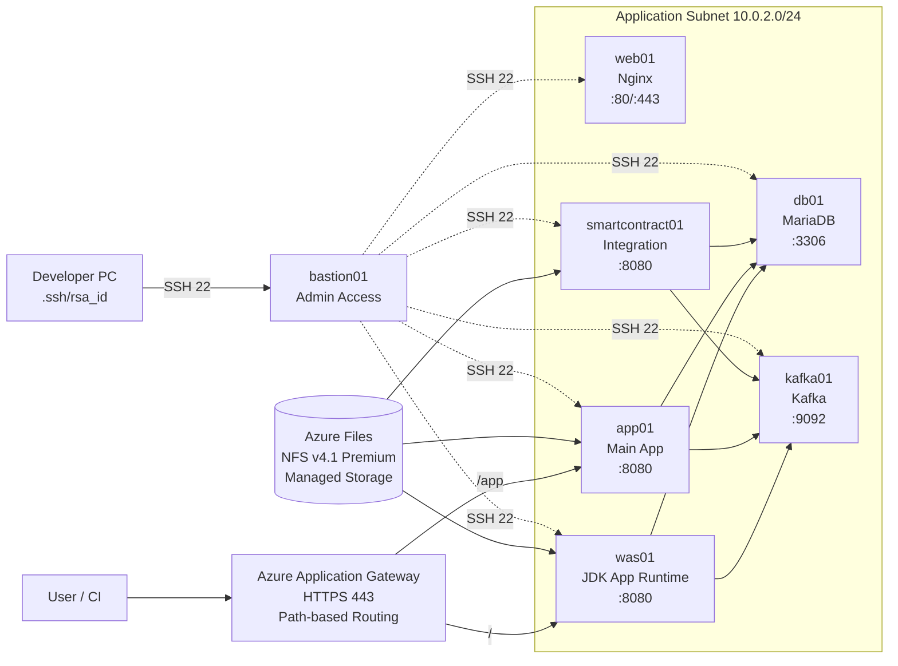
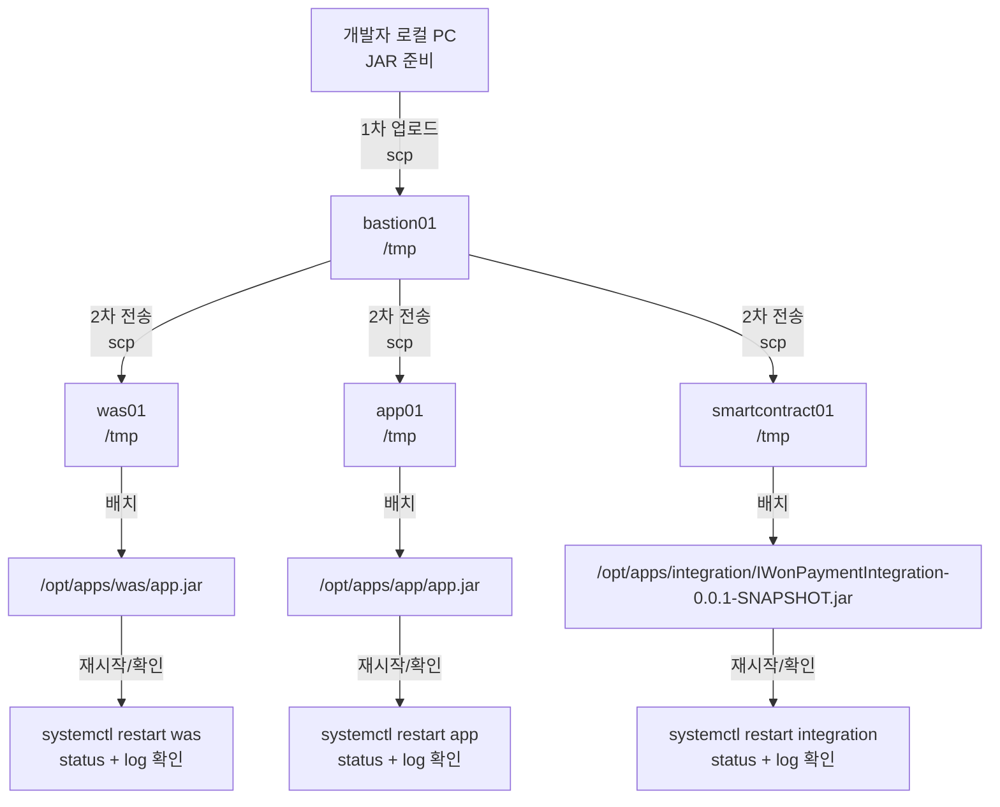

# Azure VM 개발자 접속 및 활용 가이드

이 문서는 [`vm-azure/readme-shell.md`](/c:/Workspace/k8s-lab-dabin/vm-azure/readme-shell.md), [`vm-azure/readme-vm.md`](/c:/Workspace/k8s-lab-dabin/vm-azure/readme-vm.md), [`vm-azure/readme-https.md`](/c:/Workspace/k8s-lab-dabin/vm-azure/readme-https.md)를 기준으로 개발자가 실제 VM 환경에 접속해 애플리케이션 배포, DB 작업, Kafka 점검, HTTPS 접속 확인을 수행하기 위한 실무용 가이드입니다.

대상 작업:
- Bastion 경유 서버 접속
- JAR 파일 업로드 및 서비스 재기동
- MariaDB 접속 및 SQL 실행
- Kafka 접속 및 토픽/브로커 설정 확인
- HTTPS 접속 확인 및 점검

## 목차

- [1. 접속 구조](#1-접속-구조)
- [2. 로컬 PC 준비](#2-로컬-pc-준비)
- [3. 서버별 작업 경로](#3-서버별-작업-경로)
- [4. JAR 파일 업로드](#4-jar-파일-업로드)
- [5. 애플리케이션 상태 확인](#5-애플리케이션-상태-확인)
- [6. MariaDB 접속 및 SQL 실행](#6-mariadb-접속-및-sql-실행)
- [7. Kafka 접속 및 설정](#7-kafka-접속-및-설정)
- [8. HTTPS 접속 확인](#8-https-접속-확인)
- [9. 서버별 빠른 명령 모음](#9-서버별-빠른-명령-모음)
- [10. 개발자용 NFS 공유 가이드](#10-개발자용-nfs-공유-가이드)
- [11. 주의사항](#11-주의사항)
- [12. 참고 문서](#12-참고-문서)


## 1. 접속 구조

현재 구조는 로컬 PC에서 내부 VM으로 직접 접속하지 않고 `bastion01`을 통해 접근하는 방식입니다.

### 1.1 서버 목록 및 역할

| 서버명 | IP | 역할 |
|---|---|---|
| `bastion01` | `20.214.224.224` | 개발자/운영자 진입용 점프 호스트 |
| `web01` | `10.0.2.10` | Nginx / 정적 페이지 및 운영 보조 |
| `was01` | `10.0.2.20` | WAS JAR 실행 |
| `app01` | `10.0.2.30` | Main App JAR 실행 |
| `smartcontract01` | `10.0.2.40` | Integration JAR 실행 |
| `db01` | `10.0.2.50` | MariaDB |
| `kafka01` | `10.0.2.60` | Kafka 단일 브로커 |

### 1.2 VM 기반 시스템 구성도


## 2. 로컬 PC 준비

필수 도구:
- `ssh`
- `scp`
- `sftp`
- `curl`
- `mariadb` 클라이언트가 있으면 편리하지만 필수는 아님

SSH 설정 파일:
- Windows: `C:\Users\<사용자명>\.ssh\config`

예시:

```sshconfig
Host bastion01
  HostName 20.214.224.224
  User iwon
  IdentityFile ~/.ssh/id_rsa
```

접속:

```powershell
ssh bastion01
```

Bastion 안에서 내부 서버 접속:

password: 클라우드센터 공용 비번(7979포함된거)

```bash
ssh iwon@10.0.2.10
ssh iwon@10.0.2.20
ssh iwon@10.0.2.30
ssh iwon@10.0.2.40
ssh iwon@10.0.2.50
ssh iwon@10.0.2.60
```

## 3. 서버별 작업 경로

권장 경로:
- 공통 자산: `/opt/vm-lab`
- 애플리케이션 배포:
  - `was01`: `/opt/apps/was`
  - `app01`: `/opt/apps/app`
  - `smartcontract01`: `/opt/apps/integration`
- 로그:
  - `/var/log/iwon`
- 스크립트:
  - `/opt/scripts`

서비스명:
- `was`
- `app`
- `integration`
- `nginx`
- `mariadb`
- `kafka`

## 4. JAR 파일 업로드

이 장은 배포 파일을 3단계로 전달하는 절차입니다.



### 4.1 로컬 PC에서 Bastion으로 업로드
- 개발자 로컬 PC에서 Bastion으로 JAR를 1차 업로드합니다.
  
예: `app01`용 신규 JAR 업로드

```powershell
scp .\godisappserver-0.0.1-SNAPSHOT.jar bastion01:/tmp/
```

예: `was01`용 신규 JAR 업로드

```powershell
scp .\GodisWebServer-0.0.1-SNAPSHOT.jar bastion01:/tmp/
```

예: `smartcontract01`용 신규 JAR 업로드

```powershell
scp .\IWonPaymentIntegration-0.0.1-SNAPSHOT.jar bastion01:/tmp/
```

### 4.2 Bastion에서 대상 서버로 전송

- Bastion에서 내부 대상 서버(`was01`, `app01`, `smartcontract01`)로 JAR를 2차 전송합니다.

`app01`:

```bash
scp /tmp/godisappserver-0.0.1-SNAPSHOT.jar iwon@10.0.2.30:/tmp/
```

`was01`:

```bash
scp /tmp/GodisWebServer-0.0.1-SNAPSHOT.jar iwon@10.0.2.20:/tmp/
```

`smartcontract01`:

```bash
scp /tmp/IWonPaymentIntegration-0.0.1-SNAPSHOT.jar iwon@10.0.2.40:/tmp/
```

### 4.3 서버에 배치

- 각 서버의 표준 배포 경로(`/opt/apps/...`)에 JAR를 반영하고 소유권/서비스 재시작/로그 확인까지 마무리합니다.

`app01`:

```bash
ssh iwon@10.0.2.30
sudo cp /tmp/godisappserver-0.0.1-SNAPSHOT.jar /opt/apps/app/app.jar
sudo chown iwon:iwon /opt/apps/app/app.jar
sudo systemctl restart app
sudo systemctl status app --no-pager
tail -n 100 /var/log/iwon/app.log
```

`was01`:

```bash
ssh iwon@10.0.2.20
sudo cp /tmp/GodisWebServer-0.0.1-SNAPSHOT.jar /opt/apps/was/app.jar
sudo chown iwon:iwon /opt/apps/was/app.jar
sudo systemctl restart was
sudo systemctl status was --no-pager
tail -n 100 /var/log/iwon/was.log
```

`smartcontract01`:

```bash
ssh iwon@10.0.2.40
sudo cp /tmp/IWonPaymentIntegration-0.0.1-SNAPSHOT.jar /opt/apps/integration/IWonPaymentIntegration-0.0.1-SNAPSHOT.jar
sudo chown iwon:iwon /opt/apps/integration/IWonPaymentIntegration-0.0.1-SNAPSHOT.jar
sudo systemctl restart integration
sudo systemctl status integration --no-pager
tail -n 100 /var/log/iwon/integration.log
```

## 5. 애플리케이션 상태 확인

공통 확인:

```bash
sudo systemctl status was --no-pager
sudo systemctl status app --no-pager
sudo systemctl status integration --no-pager
sudo ss -lntp
```

헬스체크 예시:

```bash
curl http://127.0.0.1:8080
curl -I http://127.0.0.1
```

주의:
- 로그 디렉터리 `/var/log/iwon`은 `iwon`이 쓸 수 있어야 합니다
- `Permission denied`가 나면 아래 실행:

```bash
sudo mkdir -p /var/log/iwon
sudo chown -R iwon:iwon /var/log/iwon
```

## 6. MariaDB 접속 및 SQL 실행

### 6.1 원격 개발용 SQL 클라이언트(DBeaver) 접속

#### 현재 SSH 인증 구조

| 구간 | 인증 방식 | 상태 |
|------|---------|------|
| 로컬 PC → bastion01 | 키 인증 (RSA 4096) | ✓ 구성 완료 |
| bastion01 → db01 | 비밀번호 인증 | ✓ 현재 상태 |

#### SQL 클라이언트용 SSH 터널 
**SQL 클라이언트(DBeaver) 설정**

**1. DBeaver 연결설정(Connection settings)의 Advanced 탭에서 +SSH를 선택하면 SSH 탭 생성됨.**

**2. General 탭 설정:**
Host: 10.0.2.50
Port: 3306
Database: appdb
User: appuser
Password: <APP_DB_PASSWORD>

**3. SSH 탭 설정:**
Host: 20.214.224.224
User: iwon
키 파일 지정(.ssh/id_rsa)

연결 후 DBeaver에서 `mysql.user` 또는 시스템 스키마 메타데이터 조회 시 권한 에러가 보일 수 있습니다. 이는 `appuser` 에게 `mysql.*` 권한을 주지 않았기 때문이며, `appdb` 조회와 수정에는 영향이 없습니다.

### 6.2 db01 접속

```bash
ssh bastion01
ssh iwon@10.0.2.50
```

### 6.3 서버 상태 확인

```bash
mariadb --version
sudo mariadb -e "SELECT VERSION();"
sudo systemctl status mariadb --no-pager
sudo ss -lntp | grep 3306
```

### 6.4 로컬 MariaDB 쉘 접속

```bash
sudo mariadb
```

특정 DB 접속:

```bash
sudo mariadb appdb
```

### 6.5 SQL 직접 실행

예: 테이블 목록

```bash
sudo mariadb appdb -e "SHOW TABLES;"
```

예: 애플리케이션 계정 생성 전 `!` 이스케이프 문제 방지

```bash
set +H
sudo mariadb -e "ALTER USER 'appuser'@'%' IDENTIFIED BY '<APP_DB_PASSWORD>';"
sudo mariadb -e "CREATE USER IF NOT EXISTS 'appuser'@'bastion01.internal.cloudapp.net' IDENTIFIED BY '<APP_DB_PASSWORD>';"
sudo mariadb -e "CREATE USER IF NOT EXISTS 'appuser'@'10.0.3.%' IDENTIFIED BY '<APP_DB_PASSWORD>';"
sudo mariadb -e "GRANT ALL PRIVILEGES ON appdb.* TO 'appuser'@'%';"
sudo mariadb -e "GRANT ALL PRIVILEGES ON appdb.* TO 'appuser'@'bastion01.internal.cloudapp.net';"
sudo mariadb -e "GRANT ALL PRIVILEGES ON appdb.* TO 'appuser'@'10.0.3.%';"
sudo mariadb -e "FLUSH PRIVILEGES;"
```

현재 운영 기준 계정 패턴:

- `appuser@'%'`
- `appuser@'bastion01.internal.cloudapp.net'`
- `appuser@'10.0.3.%'`

이렇게 두는 이유:

- SSH 터널 또는 DBeaver 접속 시 클라이언트 호스트가 `bastion01.internal.cloudapp.net` 으로 식별될 수 있음
- Bastion 사설 대역에서 직접 붙는 경우 `10.0.3.%` 패턴이 매칭될 수 있음
- 일반 애플리케이션 접속은 `appuser@'%'` 로 수용 가능

주의:

- `appuser` 는 `appdb.*` 권한만 부여하는 앱 계정으로 유지
- DBeaver에서 `mysql.user` 조회 관련 `SELECT command denied` 가 보일 수 있는데, 이는 시스템 DB 권한이 없어서 발생하는 정상 동작임
- 실제 업무 쿼리는 반드시 `appdb` 기준으로 실행

예: SQL 파일 실행

```bash
sudo mariadb appdb < /opt/vm-lab/backup/db/all.sql
```

### 6.5 collation 오류 대응

`Unknown collation`, `COLLATION ... is not valid for CHARACTER SET ...` 오류가 나면:

```bash
grep -n "uca1400" /opt/vm-lab/backup/db/all.sql | head
grep -n "utf8mb3.*utf8mb4_general_ci" /opt/vm-lab/backup/db/all.sql | head
```

자동 보정 스크립트:

```bash
chmod +x /opt/vm-lab/vm-azure/fix-mariadb-collation.sh
/opt/vm-lab/vm-azure/fix-mariadb-collation.sh /opt/vm-lab/backup/db/all.sql appdb utf8mb3_general_ci utf8mb4_general_ci
```


**터널 열기 (로컬 PC에서)**

```powershell
# PowerShell - 터널 유지
ssh -N -L 13306:10.0.2.50:3306 bastion01
```

**테스트 (터널 열린 상태에서)**

```powershell
mariadb -h 127.0.0.1 -P 13306 -u appuser -p appdb
# <APP_DB_PASSWORD> 입력
```

DBeaver, MySQL Workbench, HeidiSQL 등도 같은 설정으로 연결 가능.

---

### 6.7 선택사항: Bastion → db01 키 기반 인증 구성

Bastion 운영자가 db01에 자주 접속하거나, 자동화 스크립트를 구성할 때 유용합니다.

현재 상태:
- 이 작업은 수행 완료
- `bastion01 -> db01`은 키 기반 인증으로 접속 가능
- Bastion에서 아래 명령 실행 시 비밀번호를 묻지 않으면 정상입니다

```bash
ssh iwon@10.0.2.50
```

#### 현재 상태 vs 변경 후

| 작업 | 비용 (현재) | 이점 (변경 후) |
|------|-----------|-------------|
| SQL 클라이언트 접속 | 터널만 필요 | 터널 + 추가 인증 없음 |
| Bastion에서 db01 셸 | `ssh iwon@10.0.2.50` (비밀번호 입력) | `ssh iwon@10.0.2.50` (비밀번호 생략) |
| 자동화 스크립트 | 비밀번호 필요 | 키 기반 가능 |

#### 구성 절차

**Step 1: Bastion에서 공개키 생성**

```bash
ssh bastion01
# bastion01 내부:
ssh-keygen -t rsa -b 4096 -f ~/.ssh/id_rsa -N ""
cat ~/.ssh/id_rsa.pub
```

화면에 출력되는 **공개키 전체 복사** (문자열이 길지만 한 줄)

**Step 2: db01에 공개키 등록**

```bash
# bastion01에서:
ssh iwon@10.0.2.50
# (이 단계에서만 비밀번호 입력 필요)

# db01 내부 (iwon 계정):
mkdir -p ~/.ssh
chmod 700 ~/.ssh

# Step 1에서 복사한 공개키를 붙여넣기:
cat >> ~/.ssh/authorized_keys << 'EOF'
ssh-rsa AAAAB3NzaC1yc2EAAAA... (Step 1의 전체 공개키 내용)
EOF

chmod 600 ~/.ssh/authorized_keys
exit
```

**Step 3: 키 기반 접속 확인**

```bash
# Bastion에서:
ssh iwon@10.0.2.50
# "비밀번호를 묻지 않고" 접속되면 성공
exit
```

**Step 4: SQL 클라이언트 설정 예시**

- **Host**: `127.0.0.1`
- **Port**: `13306`
- **User**: `appuser`
- **Password**: `DB 비밀번호`
- **Database**: `appdb`

**요점**:
- SQL 클라이언트 터널은 `bastion01`로의 SSH 연결만 필요 (키 인증)
- Bastion에서 db01로의 SSH는 키 기반으로 변경 가능 (선택사항)
## 7. Kafka 접속 및 설정

### 7.1 kafka01 접속

```bash
ssh bastion01
ssh iwon@10.0.2.60
```

### 7.2 Kafka 서비스 확인

```bash
sudo systemctl status kafka --no-pager
sudo ss -lntp | grep 9092
```

설정 파일:
- `/etc/kafka/server.properties`

핵심 값:
- `advertised.listeners=PLAINTEXT://10.0.2.60:9092`
- `default.replication.factor=1`
- `min.insync.replicas=1`

### 7.3 토픽 조회/생성/설명

```bash
/opt/kafka/bin/kafka-topics.sh --bootstrap-server 127.0.0.1:9092 --list
/opt/kafka/bin/kafka-topics.sh --bootstrap-server 127.0.0.1:9092 --create --topic dev-sample --partitions 1 --replication-factor 1
/opt/kafka/bin/kafka-topics.sh --bootstrap-server 127.0.0.1:9092 --describe --topic dev-sample
```

### 7.4 메시지 송수신 테스트

Producer:

```bash
/opt/kafka/bin/kafka-console-producer.sh --bootstrap-server 127.0.0.1:9092 --topic dev-sample
```

Consumer:

```bash
/opt/kafka/bin/kafka-console-consumer.sh --bootstrap-server 127.0.0.1:9092 --topic dev-sample --from-beginning
```

### 7.5 Kafka 설정 변경

설정 변경 순서:

1. `/etc/kafka/server.properties` 수정
2. 문법/값 검토
3. 서비스 재시작
4. 토픽/포트 재검증

예:

```bash
sudo vi /etc/kafka/server.properties
sudo systemctl restart kafka
sudo systemctl status kafka --no-pager
```

로그 확인:

```bash
sudo journalctl -u kafka -n 100 --no-pager
```

### 7.6 로컬 개발 PC에서 Kafka 접근

Kafka도 내부망 전용이므로 포트포워딩이 필요합니다.

```powershell
ssh -L 19092:10.0.2.60:9092 bastion01
```

그 후 로컬에서:
(사전준비 사항) **Kafka CLI** 설치 필요
```powershell
kafka-topics.bat --bootstrap-server 127.0.0.1:19092 --list
```

## 8. HTTPS 접속 확인

현재 HTTPS 공개 엔드포인트는 Application Gateway 기준입니다.

관련 값:
- App Gateway Public IP: `20.194.3.246`
- Bastion Public IP: `20.214.224.224`
- Key Vault Name: `iwonsvckvkrc001`

접속 방식:

- **windows에서는 curl.exe 사용 (인증서 검증 무시 옵션 `-k` 필요)**
  
1. DNS 연결 전 테스트

```powershell
curl -k https://20.194.3.246
```
2. DNS 확인
- 실행 명령어:

```powershell
nslookup iwon-smart.site
```

- 결과:

```text
Server:  kns.kornet.net
Address:  168.126.63.1

Non-authoritative answer:
Name:    iwon-smart.site
Address:  20.194.3.246
```

- 판정:

  - DNS A 레코드는 App Gateway 공인 IP로 정상 연결됨

3. DNS 연결 후 FQDN 테스트

```powershell

curl -vk https://www.iwon-smart.site
curl -vk https://www.iwon-smart.site/app
```

브라우저 테스트:
- `https://www.iwon-smart.site`
- `https://www.iwon-smart.site/app`

확인 포인트:
- 인증서 체인 정상 여부
- HTTP -> HTTPS 리다이렉트 여부
- App Gateway 백엔드 헬스 정상 여부
- `/` 경로가 web01으로 전달되는지 여부
- `/app` 경로가 app01으로 전달되는지 여부

### 8.1 라우팅 구조

- `https://www.iwon-smart.site` -> `web01:80`
- `https://iwon-smart.site` -> `web01:80`
- `https://www.iwon-smart.site/app` -> `app01:8080`
- 외부 포트 `:8090`은 사용하지 않음

### 8.2 백엔드 점검

```bash
ssh bastion01
ssh iwon@10.0.2.20
sudo systemctl status was --no-pager
curl -I http://127.0.0.1:8080/

ssh iwon@10.0.2.30
sudo systemctl status app --no-pager
curl -I http://127.0.0.1:8080/app
```

### 8.3 HTTPS 문제 시 확인 순서

1. DNS가 App Gateway IP를 가리키는지 확인
2. App Gateway 백엔드 헬스 확인
3. `was01`, `app01`에서 8080 응답 확인
4. 인증서/Key Vault 연결 확인
5. 보안그룹/Firewall 규칙 확인

## 9. 서버별 빠른 명령 모음

`was01`

```bash
ssh iwon@10.0.2.20
sudo systemctl restart was
tail -n 100 /var/log/iwon/was.log
```

`app01`

```bash
ssh iwon@10.0.2.30
sudo systemctl restart app
tail -n 100 /var/log/iwon/app.log
```

`smartcontract01`

```bash
ssh iwon@10.0.2.40
sudo systemctl restart integration
tail -n 100 /var/log/iwon/integration.log
```

`db01`

```bash
ssh iwon@10.0.2.50
sudo mariadb appdb -e "SHOW TABLES;"
```

`kafka01`

```bash
ssh iwon@10.0.2.60
/opt/kafka/bin/kafka-topics.sh --bootstrap-server 127.0.0.1:9092 --list
```

## 10. 개발자용 NFS 공유 가이드

### 10.1 NFS 마운트 위치

- 대상 서버: `was01`, `app01`, `smartcontract01`
- 로컬 마운트 경로: `/mnt/shared`
- Azure Files 공유명: `shared`
- 스토리지 계정: `iwonsfskrciwonsvcrg01`

빠른 확인(각 서버 접속 후):

```bash
mount | grep /mnt/shared
df -hT /mnt/shared
```

개발자 직접 확인(서버 접속):

```bash
# 1) Bastion 접속
ssh bastion01

# 2) was01 확인
ssh iwon@10.0.2.20
mount | grep /mnt/shared
df -hT /mnt/shared
grep /mnt/shared /etc/fstab
exit

# 3) app01 확인
ssh iwon@10.0.2.30
mount | grep /mnt/shared
df -hT /mnt/shared
grep /mnt/shared /etc/fstab
exit

# 4) smartcontract01 확인
ssh iwon@10.0.2.40
mount | grep /mnt/shared
df -hT /mnt/shared
grep /mnt/shared /etc/fstab
exit
```

### 10.2 상태 확인 방법

정상 기준:

- `mount` 결과에 `/mnt/shared`가 표시됨
- `df -hT /mnt/shared` 결과에 NFS 파일시스템이 표시됨
- `/etc/fstab`에 `/mnt/shared` 엔트리가 존재함

참고:

- `aznfs` 사용 시 `mount` 출력에 `127.0.0.1:/...` 형태가 보일 수 있으며 정상 동작입니다.

### 10.3 개발자 사용 방법

#### 공용 디렉터리 예시 생성

```bash
sudo mkdir -p /mnt/shared/{releases,uploads,tmp}
sudo chown -R iwon:iwon /mnt/shared/{releases,uploads,tmp}
```

#### 파일 공유 동작 확인

`was01`에서:

```bash
echo "nfs-smoke-from-was01" > /mnt/shared/tmp/nfs-smoke.txt
ls -l /mnt/shared/tmp/nfs-smoke.txt
```

`app01` 또는 `smartcontract01`에서:

```bash
cat /mnt/shared/tmp/nfs-smoke.txt
```

동일 내용이 보이면 공유 스토리지가 정상입니다.

### 10.4 문제 발생 시 개발자 대응 범위

개발자가 할 수 있는 1차 점검:

```bash
# 대상 서버에서 공통 실행
mount | grep /mnt/shared
df -hT /mnt/shared
ls -al /mnt/shared
```

운영팀에 전달할 정보:

- 어느 서버에서 실패했는지 (`was01`, `app01`, `smartcontract01`)
- 실패 명령어와 에러 메시지 원문
- `mount | grep /mnt/shared` 결과
- `df -hT /mnt/shared` 결과

참고:

- NFS 재마운트 자동화와 운영 진단 스크립트 실행은 운영 담당자 영역입니다.

## 11. 주의사항

- 내부 VM은 Public IP가 없으므로 반드시 Bastion을 거칩니다
- 운영 DB SQL 실행 전에는 백업부터 확인합니다
- JAR 교체 전 현재 서비스 상태와 로그를 먼저 확인합니다
- Kafka는 단일 브로커 구성이라 replication 관련 운영 설정은 1 기준입니다
- HTTPS 문제는 앱 문제가 아니라 App Gateway, DNS, Key Vault, Nginx 중 어느 계층 문제인지 나눠서 봐야 합니다
- 비밀번호, 인증서, 키 파일은 문서나 저장소에 평문으로 남기지 않는 것이 원칙입니다

## 12. 참고 문서

- [`vm-azure/readme-shell.md`](/c:/Workspace/k8s-lab-dabin/vm-azure/readme-shell.md)
- [`vm-azure/readme-vm.md`](/c:/Workspace/k8s-lab-dabin/vm-azure/readme-vm.md)
- [`vm-azure/readme-https.md`](/c:/Workspace/k8s-lab-dabin/vm-azure/readme-https.md)
- [`vm-azure/fix-mariadb-collation.sh`](/c:/Workspace/k8s-lab-dabin/vm-azure/fix-mariadb-collation.sh)
