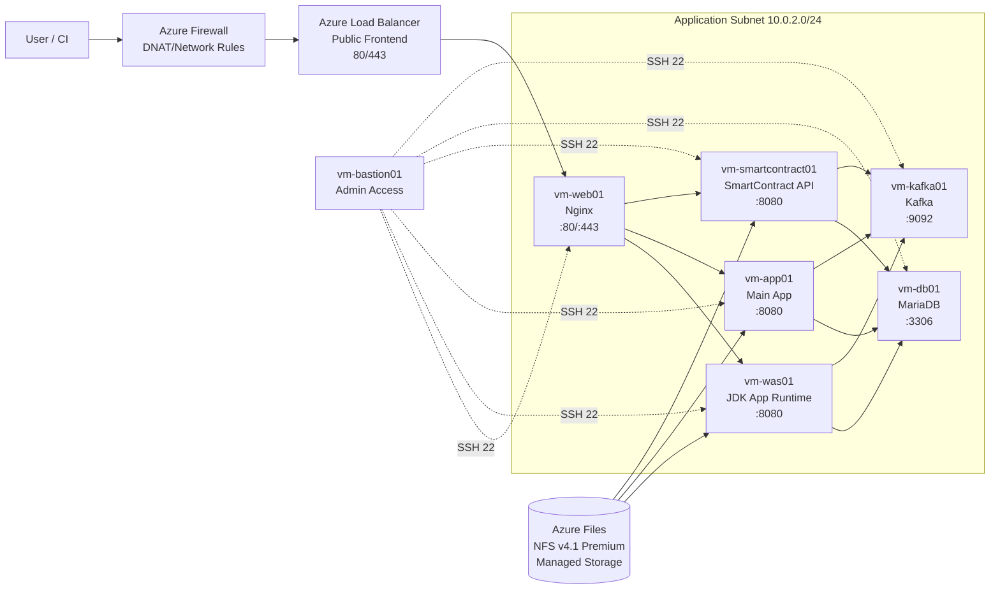

# Azure VM 직접 구성 가이드

이 문서는 Azure VM 기반으로 애플리케이션/데이터 계층을 직접 운영하기 위한 기준 구성을 정의합니다.

핵심 목표:
- 계층 분리(경계 보안, 웹, 앱, 데이터)를 명확히 유지
- VM 단위로 보안 기준과 운영 기준을 명확히 정의
- 파일 스토리지는 Azure 관리형 서비스로 운영

## 1. 구성 원칙

- 네트워크 대역은 기존 운영값(10.0.2.0/24)을 유지
- 외부 진입은 Azure Load Balancer 1개로 단일화하고 백엔드 직접 노출 금지
- 경계 보안은 Azure Firewall + Azure Load Balancer 조합으로 구성
- 파일 스토리지는 Azure Files NFS(v4.1, Premium) 사용
- DB(MariaDB)와 Kafka를 VM 직접 구성으로 포함

## 2. VM 기반 시스템 구성도

스토리지 선택 기준:
- 기본: Azure Files NFS v4.1 (운영 단순화, 관리형 파일공유)
- 고성능/초저지연 요구 시: Azure NetApp Files 검토

## 3. VM 매핑 테이블 (Korea Central 기준 권장 VM 타입)

| VM 이름 | 사설 IP(예시) | 주요 역할 | 권장 Azure VM 타입 | 기본 vCPU | 기본 vMem (GiB) | 오픈 포트(내부 기준) | 비고 |
|---|---|---|---|---|---|---|---|
| web01 | 10.0.2.10 | 정적 파일/리버스 프록시 | Standard_B2s | 2 | 4 | 80, 443, 22 | 공인 직접 노출 금지 권장 |
| was01 | 10.0.2.20 | WAS/JDK 기반 비즈니스 서비스 | Standard_D4s_v5 | 4 | 16 | 8080, 22 | LB 또는 web 계층에서만 접근 |
| app01 | 10.0.2.30 | 메인 애플리케이션 서비스 | Standard_D4s_v5 | 4 | 16 | 8080, 22 | 내부 API 제공 |
| smartcontract01 | 10.0.2.40 | 스마트컨트랙트 연동 서비스 | Standard_D2s_v5 | 2 | 8 | 8080, 22 | 내부 API 제공 |
| db01 | 10.0.2.50 | MariaDB DB 서버 | Standard_E4s_v5 | 4 | 32 | 3306, 22 | Private 전용, 백업 필수 |
| kafka01 | 10.0.2.60 | Kafka 브로커(단일 노드 기본) | Standard_D4s_v5 | 4 | 16 | 9092, 22 | 운영은 3노드(01~03) 권장 |
| bastion01 | 10.0.2.101 | 점프 호스트(운영자 접속) | Standard_B1ms | 1 | 2 | 22 | SSH 소스 `162.120.184.41/32`만 허용 |

기준:
- 기본 vCPU/vMem은 표의 `권장 Azure VM 타입` 스펙 기준입니다.
- Korea Central에서 일반적으로 선택 빈도가 높은 Bsv2/Dsv5/Esv5 계열 기준으로 재구성했습니다.
- 실제 배포 시점에는 구독/가용영역별 수급 차이가 있으므로 `az vm list-skus --location koreacentral`로 최종 확인하세요.

네트워크/스토리지 리소스(비 VM):

| 리소스 | 권장 SKU | 프로토콜 | 용도 | 보안 권장 |
|---|---|---|---|---|
| Azure Firewall | Standard (기본), Premium (TLS 검사/IDPS 필요 시) | L3/L4, DNAT | 외부 유입 통제, 아웃바운드 제어, 위협 차단 정책 적용 | Firewall Policy 사용, 진단 로그/위협 인텔리전스 활성화 |
| Azure Load Balancer | Standard Public Load Balancer | L4(TCP) | 외부 80/443 수신 후 vm-web01 백엔드 전달 | Standard SKU 사용, NSG 연동, 진단 로그 활성화 |
| Azure Files | Premium FileStorage | NFS v4.1 | vm-was01/vm-app01/vm-smartcontract01 공유 스토리지 | 공용 접근 차단, 허용 네트워크 제한, 백업/스냅샷 활성화 |

## 4. 기본 보안 구성 (필수)

### 4.1 네트워크/경계 보안

- NSG 기본 정책
  - Inbound default deny
  - 인터넷 직접 유입 차단, Azure Firewall을 통한 유입만 허용
  - Azure Firewall DNAT -> Azure Load Balancer frontend(80/443) 경로만 허용
  - Bastion Public SSH(22) Inbound는 `162.120.184.41/32`에서만 허용
  - 내부 VM SSH(22)는 `bastion01`에서만 접근 허용
  - DB(3306)/Kafka(9092) 클라이언트 접근은 승인된 소스 CIDR만 허용(예: 사내 VPN 대역)
- 백엔드(vm-was01, vm-app01, vm-smartcontract01, vm-db01, vm-kafka01)는 Public IP 미할당
- 서브넷 분리 권장
  - AzureFirewallSubnet: Azure Firewall 전용
  - ingress-subnet: vm-web01 (LB 백엔드)
  - app-subnet: 앱 VM
  - mgmt-subnet: vm-bastion01
- East-West 트래픽 최소화
  - vm-web01 -> app 계층(8080)만 허용
  - app 계층 -> Azure Files NFS(2049)만 허용
  - app 계층 -> DB(3306)만 허용
  - app 계층 -> Kafka(9092)만 허용
- Egress 통제
  - app-subnet/ingress-subnet 기본 라우트를 Azure Firewall로 강제(UDR)
  - 허용된 목적지(FQDN/IP)만 outbound 허용

### 4.2 접근 통제

- SSH는 Key 기반만 허용(PasswordAuthentication no)
- root 직접 로그인 금지(PermitRootLogin no)
- 운영 계정은 개인 계정 분리, sudo 최소권한 부여
- Azure NSG/Firewall에서 관리자 원격접속 소스는 `162.120.184.41/32` 단일 IP로 고정
- 비밀정보(.env, 키 파일)는 Azure Key Vault 또는 최소한 OS 권한 600으로 보호

### 4.3 OS/런타임 하드닝

- UFW 또는 nftables 활성화(서비스 포트만 허용)
- 자동 보안 업데이트 활성화(unattended-upgrades)
- fail2ban 활성화(SSH 보호)
- 시간 동기화(chrony)
- 불필요 패키지/서비스 제거

### 4.4 애플리케이션 보안

- TLS 1.2+ 강제, 인증서는 TLS 종단 계층에서 중앙관리(App Gateway + Key Vault 권장)
- 내부 서비스는 LB 또는 web 계층에서만 호출 허용
- 애플리케이션 로그에 민감정보 마스킹
- 컨피그/시크릿 분리(코드 저장소 커밋 금지)

### 4.5 운영 보안

- 중앙 로그 수집(예: Azure Monitor Agent)
- 보안 이벤트 경보(SSH 실패, sudo 사용, 디스크 임계치)
- Azure Files 데이터 백업 정책 수립
  - 일 1회 스냅샷
  - 주 1회 오프사이트/다른 스토리지 복제
- 정기 점검
  - 월 1회 취약점 스캔
  - 분기 1회 복구 리허설

## 5. 서비스 배치 기준

- web01
  - Nginx systemd 서비스
  - upstream으로 vm-was01/vm-app01/vm-smartcontract01 라우팅
- vm-was01, vm-app01, vm-smartcontract01
  - 각 서비스별 systemd unit 분리
  - 배포 산출물은 /opt/apps/<service> 구조 권장
  - health endpoint (/health) 표준화
- vm-db01 (MariaDB)
  - 데이터 디렉토리 분리(/data/mysql)
  - 정기 백업 + PITR 전략(일단위 full, binlog 보관)
  - DB 접근 소스는 app 계층으로 제한
- vm-kafka01 (Kafka)
  - 기본 포트 9092, 내부 네트워크 전용
  - 운영은 다중 브로커(3노드) + 토픽 replication.factor=3 권장
  - 로그/세그먼트 보존 정책(retention.ms, retention.bytes) 명시
- Azure Files(NFS)
  - 파일공유 마운트 경로 표준화(예: /mnt/shared)
  - 허용 네트워크/CIDR 최소화(운영 대역만)

## 6. 배포/운영 절차 권장

1. 인프라 준비
  - VM 생성, Azure Firewall/LB, NSG/UDR/서브넷 정책 적용
2. 공통 하드닝
   - 계정/SSH/패치/방화벽/모니터링 에이전트 구성
3. 런타임 설치
  - Nginx, JDK, MariaDB, Kafka, NFS 클라이언트, 공통 유틸
4. 애플리케이션 배포
   - 서비스 바이너리/이미지 배포, systemd 등록
5. 트래픽 전환
   - LB 백엔드 등록 후 단계 전환(canary 또는 blue-green)
6. 운영 안정화
   - 알람/로그/백업 점검, 장애복구 문서화

## 7. Ansible 운영 자동화 방향

기존 ansible 역할에서 재사용 가능한 부분:
- common: 호스트 기본 설정, sysctl, 시간 동기화

대체 권장:
- Azure Load Balancer는 IaC(Terraform/Bicep)로 관리
- 웹 계층(vm-web01)의 Nginx 설정만 Ansible로 관리

신규 권장 자동화:
- storage 마운트 역할 추가(예: azure_files_mount)
  - 패키지 설치(nfs-common)
  - /etc/fstab 마운트 정의
  - 마운트 상태 점검

권장:
- VM 전용 플레이북(예: ansible/site-vm.yaml) 추가
- 인벤토리 그룹을 [web], [app], [db], [kafka], [bastion] 형태로 재구성

## 8. 체크리스트

- [ ] Azure Load Balancer frontend 외 Public Inbound 차단
- [ ] Public Inbound는 Azure Firewall DNAT 경로로만 허용
- [ ] Azure Firewall Policy(네트워크/DNAT 규칙) 및 로그 활성화
- [ ] Bastion SSH(22) 소스 IP를 `162.120.184.41/32`로 고정
- [ ] SSH 비밀번호 로그인 비활성화
- [ ] 각 VM 방화벽 최소 포트 허용
- [ ] systemd 서비스 자동시작/헬스체크 적용
- [ ] 로그/메트릭 중앙 수집 연결
- [ ] Azure Files 백업/복구 테스트 완료
- [ ] MariaDB 백업/복구 리허설 완료
- [ ] Kafka 토픽 복제/보존 정책 점검 완료
- [ ] Key Vault 비밀/인증서 접근 권한을 Managed Identity + RBAC로 최소권한 부여
- [ ] Key Vault 네트워크를 Private Endpoint 기반으로 제한하고 Public access 차단
- [ ] 인증서 만료 30일 전 경보 및 자동/반자동 교체 절차 검증
- [ ] 운영 문서(접속, 배포, 롤백) 최신화

## 9. Azure Key Vault 연동 추가 항목 (권장)

이 절은 현재 VM 직접 구성에서 인증서/비밀 관리를 Azure Key Vault로 표준화하기 위한 필수 추가 항목입니다.

### 9.1 저장 대상 정의

- Secret 저장 대상
  - DB 접속 정보: `db-host`, `db-port`, `db-username`, `db-password`
  - Kafka 접속 정보: `kafka-bootstrap-servers`, `kafka-sasl-password`(사용 시)
  - 외부 API 키: `external-api-key-*`
  - 애플리케이션 환경값 중 민감정보
- Certificate 저장 대상
  - HTTPS 서버 인증서(PFX/PEM 체인)
  - 내부 mTLS를 적용할 경우 클라이언트/서버 인증서

네이밍 권장:
- `<env>-<service>-<purpose>` 형태 사용
- 예시: `prod-web-tls-cert`, `prod-app-db-password`

### 9.2 아키텍처 반영 포인트

- 기본 원칙
  - 비밀은 파일에 평문 저장 금지
  - 애플리케이션 시작 시 Key Vault에서 읽어 메모리에만 유지
  - 로컬 디스크 캐시가 필요하면 암호화 + 단기 TTL 적용
- HTTPS 종단 권장
  - Key Vault 인증서를 중앙 연동하려면 Azure Application Gateway(WAF v2)에서 TLS 종단(Option B) 권장
  - 현재 Azure Load Balancer(L4) 단독 구조를 유지하면 VM(Nginx)에서 인증서 배포/교체를 별도 자동화해야 함

### 9.3 접근 제어 (RBAC/Identity)

- VM별 시스템 할당 Managed Identity 활성화
  - `web01`, `was01`, `app01`, `smartcontract01`에 우선 적용
- Key Vault 권한 모델
  - Access Policy 대신 Azure RBAC 모델 사용 권장
  - 최소 권한 원칙으로 역할 분리
    - 비밀 조회: `Key Vault Secrets User`
    - 인증서 조회: `Key Vault Certificates Officer` 또는 조회 전용 조합
    - 관리 작업(회전/생성): 운영 자동화 계정에만 부여
- 금지 사항
  - 사람 계정에 장기 고권한(Role: Owner 수준) 직접 부여 금지
  - 공용 저장소에 SP Client Secret 커밋 금지

### 9.4 네트워크 보안

- Key Vault Public Network Access: `Disabled` 권장
- Private Endpoint로 `mgmt-subnet` 또는 `app-subnet`에서만 접근 허용
- Private DNS Zone(`privatelink.vaultcore.azure.net`) 연결
- Azure Firewall egress 정책에서 Key Vault FQDN만 허용(필요 최소)

### 9.5 애플리케이션/운영 구현 항목

- 배포 파이프라인
  - CI/CD에서 비밀값을 변수로 주입하지 않고 Key Vault 참조 방식 사용
  - 배포 전 단계에서 필수 비밀 존재 여부 검증
- 런타임
  - 서비스 시작 전 pre-flight 체크: Key Vault 연결, 필수 secret 존재, 만료일 확인
  - 실패 시 즉시 비정상 종료하여 잘못된 기본값으로 기동되지 않도록 처리
- 감사/모니터링
  - Key Vault 진단 로그를 Log Analytics로 수집
  - 실패한 비밀 조회, 권한 거부, 삭제/권한 변경 이벤트 경보 설정

### 9.6 인증서/비밀 회전 정책

- 비밀(Secret)
  - 기본 90일 회전(운영 정책에 맞게 조정)
  - 회전 후 애플리케이션 무중단 재적용 절차(runbook) 문서화
- 인증서(Certificate)
  - 만료 30일/14일/7일 전 단계 경보
  - 교체 리허설 분기 1회 수행
- 복구
  - Soft Delete + Purge Protection 활성화(필수)
  - 오삭제 복구 절차 및 책임자 지정

### 9.7 Terraform 반영 체크포인트

- 필수 리소스
  - `azurerm_key_vault`
  - `azurerm_private_endpoint` (Key Vault)
  - `azurerm_private_dns_zone` + vnet link
  - `azurerm_role_assignment` (Managed Identity -> Key Vault RBAC)
- 권장 설정
  - `soft_delete_retention_days` 설정
  - `purge_protection_enabled = true`
  - `public_network_access_enabled = false`
  - `network_acls` 최소 허용 정책

### 9.8 운영 체크리스트 (Key Vault 전용)

- [ ] VM Managed Identity 활성화 완료
- [ ] Key Vault RBAC 최소권한 적용 완료
- [ ] Key Vault Private Endpoint + Private DNS 연결 완료
- [ ] Key Vault 진단 로그/경보 대시보드 구성 완료
- [ ] Secret/Certificate 회전 runbook 및 정기 리허설 완료

## 10. Terraform 작성 전 최종 확정 항목

아래 항목이 확정되면 현재 문서 기준으로 Terraform 코드 작성이 가능합니다.

### 10.1 네트워크/주소 체계

- VNet CIDR (예: 10.0.0.0/16)
- 각 서브넷 CIDR
  - AzureFirewallSubnet
  - ingress-subnet
  - app-subnet
  - mgmt-subnet
- 고정 사설 IP 사용 여부 및 NIC별 고정 IP 할당 정책

### 10.2 인바운드 정책 상세

- DB/Kafka 클라이언트 접근 허용 소스 CIDR 확정
  - 현재 문서는 "접근 허용"만 정의되어 있어 Terraform NSG/Firewall 규칙 작성 시 소스 범위가 필요
- Bastion 관리 포트(22) 외 운영 포트 허용 여부 확정

### 10.3 HTTPS 종단 아키텍처 확정

- 옵션 A: Azure Load Balancer(L4) + web01(Nginx) TLS 종단
- 옵션 B: Azure Application Gateway(WAF v2) TLS 종단 + Key Vault 인증서 연동
- 옵션 B 선택 시 Terraform 리소스 추가 필요
  - `azurerm_application_gateway`
  - `azurerm_web_application_firewall_policy`(WAF 정책 사용 시)

### 10.4 가용성/확장 기준

- Kafka 배포 모드 확정
  - 단일 노드(`kafka01`) 또는 3노드(`kafka01~03`)
- DB 고가용성 전략 확정
  - 단일 VM + 백업 복구 또는 이중화 구성
- 가용영역(Zone) 사용 여부 확정

### 10.5 VM 상세 파라미터

- OS 이미지(Publisher/Offer/SKU/Version)
- OS Disk 타입/크기(Premium SSD v2, Premium SSD 등)
- 데이터 디스크 크기/개수(DB/Kafka)
- 관리자 계정명, SSH 공개키 경로, cloud-init/user-data 사용 여부

### 10.6 운영 연동 리소스

- Log Analytics Workspace/진단 설정 대상 확정
- 백업 정책의 실제 리소스 매핑 확정
  - Azure Files snapshot 주기
  - DB 백업 저장 위치/보관기간

### 10.7 Terraform 구조 권장

- 모듈 분리
  - `network`, `security`, `compute`, `storage`, `keyvault`, `monitoring`
- 환경 분리
  - `dev`, `stg`, `prod` tfvars 분리
- 적용 순서
  1. network/security
  2. keyvault/private endpoint/dns
  3. compute/storage
  4. monitoring/diagnostics

---

이 문서는 현재 저장소의 VM 운영 요구사항을 기준으로 작성한 Azure VM 구성 가이드입니다. 실제 운영 반영 시 Azure 구독/리소스그룹/보안정책 표준에 맞춰 IP, 포트, 계정정책을 확정하세요.
