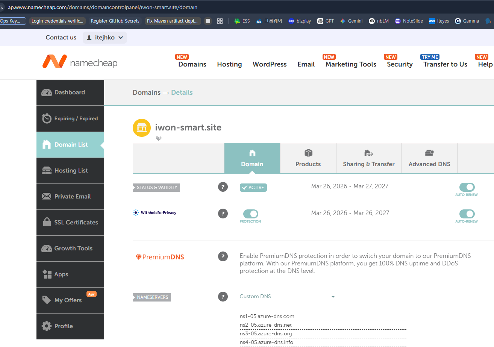

# Namecheap 등록 유지 + Azure DNS 네임서버 위임 가이드

## 목적
- 도메인 등록기관은 Namecheap에 그대로 유지
- 권한 DNS(네임서버)만 Azure DNS로 위임

## 사전 확인
- Azure DNS는 완전 무료가 아니며, 일반적으로 Zone + Query 기준 과금
- 전환 전 Namecheap의 기존 DNS 레코드 전체 백업 필요
- 메일 사용 중이면 MX/SPF/DKIM/DMARC 레코드 누락 금지

## 서비스 도메인 구매 정보
https://www.namecheap.com/
id: itejhko
password: 클라우드센터 공용 비번(7979포함된거)
도메인: iwon-smart.site

## 진행 순서

### 1) Azure DNS Zone 생성
1. Azure Portal 접속
2. DNS zones > Create 선택
3. Zone name에 도메인 입력 (예: yourdomain.com)
4. 생성 완료 후 NS 레코드 4개 값 확인 및 복사

### 2) Namecheap 기존 레코드 백업
1. Namecheap > Domain List > 해당 도메인 > Advanced DNS 이동
2. 현재 설정된 레코드를 모두 백업
3. 아래 항목이 있는지 확인
   - A / AAAA / CNAME
   - MX
   - TXT (SPF, DKIM, DMARC, 소유권 검증)
   - 기타 서비스용 레코드

### 3) Azure DNS에 레코드 선반영
1. Azure DNS Zone에서 기존 레코드를 동일하게 생성
2. 루트(@), www, api, mail 등 필요한 호스트 전부 반영
3. 초기 전환 시 TTL은 300초 권장

### Azure DNS 현재 레코드에 설정 추가

| 이름 | 형식 | TTL | 값 |
|---|---|---|---|
| `@` | A | 3600 | `20.194.3.246` |
| `www` | A | 3600 | `20.194.3.246` |
| `@`  | TXT Record|3600| `v=spf1 include:spf.efwd.registrar-servers.com ~all` |

도메인설정화면.png)


### 4) Namecheap 네임서버 변경
1. Namecheap > Domain List > 해당 도메인 > Nameservers 이동
2. Nameservers를 Custom DNS로 변경
3. Azure DNS Zone의 NS 4개를 입력 후 저장





### 5) 전파 및 검증
1. NS 확인
   - nslookup -type=ns yourdomain.com
2. 주요 레코드 확인
   - nslookup www.yourdomain.com
   - nslookup -type=txt yourdomain.com
3. 전파 시간
   - 일반적으로 수분~수시간
   - 최대 24~48시간 소요 가능

## 전환 시 주의사항
- 메일 서비스 사용 시 MX/SPF/DKIM/DMARC 누락 시 메일 장애 발생 가능
- DNSSEC 사용 중이면 전환 과정에서 설정 일관성 확인 필요
- 캐시 영향으로 사용자별 조회 결과가 일시적으로 다를 수 있음
- 안정화 전까지 기존 서비스 중단 없이 병행 운영 권장

## 전환 당일 체크리스트
- [ ] Azure DNS Zone 생성 완료
- [ ] Azure에 레코드 선반영 완료
- [ ] Namecheap 네임서버를 Azure NS 4개로 변경 완료
- [ ] nslookup으로 NS/A/TXT 확인 완료

## 전환 여부 검증

```powershell
 nslookup -type=ns iwon-smart.site
 ```
```log
Server:  kns.kornet.net
Address:  168.126.63.1

Non-authoritative answer:
iwon-smart.site nameserver = ns1-05.azure-dns.com
iwon-smart.site nameserver = ns4-05.azure-dns.info
iwon-smart.site nameserver = ns3-05.azure-dns.org
iwon-smart.site nameserver = ns2-05.azure-dns.net

ns1-05.azure-dns.com    internet address = 13.107.236.5
ns2-05.azure-dns.net    internet address = 150.171.21.5
ns3-05.azure-dns.org    internet address = 204.14.183.5
ns4-05.azure-dns.info   internet address = 208.84.5.5
ns1-05.azure-dns.com    AAAA IPv6 address = 2603:1061:0:700::5
ns2-05.azure-dns.net    AAAA IPv6 address = 2620:1ec:8ec:700::5
ns3-05.azure-dns.org    AAAA IPv6 address = 2a01:111:4000:700::5
ns4-05.azure-dns.info   AAAA IPv6 address = 2620:1ec:bda:700::5
```

List DNS zones in the resource group to confirm the zone is created and available:
```powershell
az network dns zone list --resource-group iwon-svc-rg --subscription 51be5183-cf60-4f1f-8b9f-fb4b31daa579
```
```json
[
  {
    "etag": "b7afc9ff-fbef-4eb2-8355-5af928ca49c4",
    "id": "/subscriptions/51be5183-cf60-4f1f-8b9f-fb4b31daa579/resourceGroups/iwon-svc-rg/providers/Microsoft.Network/dnszones/iwon-smart.site",
    "location": "global",
    "maxNumberOfRecordSets": 10000,
    "name": "iwon-smart.site",
    "nameServers": [
      "ns1-05.azure-dns.com.",
      "ns2-05.azure-dns.net.",
      "ns3-05.azure-dns.org.",
      "ns4-05.azure-dns.info."
    ],
    "numberOfRecordSets": 5,
    "resourceGroup": "iwon-svc-rg",
    "tags": {},
    "type": "Microsoft.Network/dnszones",
    "zoneType": "Public"
  }
]
```