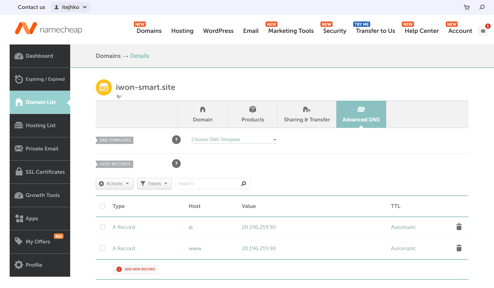

# HTTPS 구성 준비항목 

이 문서는 Azure VM 환경에서 HTTPS 종단 아키텍처를 선택할 때 필요한 준비항목을 정리한 문서입니다.

## 1. 공통 준비항목

- 서비스 도메인(FQDN) 확정
- DNS 레코드 관리 주체 및 변경 절차 확정
- 인바운드 허용 범위 확정(443, 관리 포트)
- 인증서 발급 주체 및 만료 관리 담당자 확정
- 로그 수집/모니터링 대상 확정(App Gateway 또는 Nginx)

## 1-1. 서비스 도메인 구매
https://www.namecheap.com/
id: itejhko
password: 클라우드센터 공용 비번(7979포함된거)
도메인: iwon-smart.site

www 레코드도 동일하게 연결
DNS 관리: Namecheap 대시보드에서 직접 관리



## 2. Azure Application Gateway(WAF v2) TLS 종단 + Key Vault 인증서 연동

현재 라우팅 기준:

- `https://www.iwon-smart.site` -> `web01:80`
- `https://iwon-smart.site` -> `web01:80`
- `https://www.iwon-smart.site/app` -> `app01:8080`
- `https://iwon-smart.site/app` -> `app01:8080`
- 외부 공개 포트는 `443`만 사용

### 2.1 준비항목

- App Gateway 전용 서브넷 준비(권장 /27 이상)
- App Gateway SKU를 WAF_v2로 확정
- 백엔드 대상 확정
  - 기본 경로(`/`) 대상: `web01:80`
  - `/app` 경로 대상: `app01:8080`
- Key Vault 준비
  - 인증서(PFX) 업로드 또는 발급/반입 절차 확정
  - 인증서 이름 확정(예: iwon-web-tls-cert)
- 권한 준비
  - App Gateway Managed Identity가 Key Vault 인증서를 읽을 수 있도록 권한 부여
- 정책/보안 준비
  - WAF 정책 모드(Detection/Prevention)
  - HTTP -> HTTPS 리다이렉트
  - TLS 최소 버전(TLS 1.2 이상)

### 2.2 Terraform 영향

- 필수 리소스
  - azurerm_public_ip
  - azurerm_application_gateway
  - azurerm_web_application_firewall_policy
  - azurerm_key_vault
- 선택 리소스
  - azurerm_user_assigned_identity 또는 시스템할당 MI 사용
  - azurerm_role_assignment(또는 Key Vault 접근정책)
  - azurerm_private_endpoint
  - azurerm_private_dns_zone
- 주의사항
  - App Gateway-인증서 연동 실패 대부분은 권한 또는 Key Vault 네트워크 설정 문제

### 2.3 B안 체크리스트

- [X] App Gateway 전용 서브넷이 준비되었다
- [X] App Gateway Listener/Path-based Backend/Rule 구성이 완료되었다
- [X] Key Vault 인증서 참조가 정상이다
- [X] Managed Identity 권한 부여가 완료되었다
- [X] WAF 정책이 의도한 모드로 적용되었다
- [X] HTTPS 접속 및 리다이렉트가 정상 동작한다

## 5. 실행 전 최소 확정값

- subscription_id
- resource_group_name
- location
- domain_name
- tls_option (A 또는 B)
- 인증서 소스
  - B안: Key Vault 인증서 이름

## 6. Terraform 모듈별 주요 생성 리소스 및 출력값

> App Gateway Public IP: 20.194.3.246
> Key Vault Name: iwonsvckvkrc001
> Bastion Public IP: 20.214.224.224

## 6. 실행 후 검증 포인트
1. web01/app01에서 80/8080 응답 및 헬스엔드포인트 확인 후 App Gateway 백엔드 재검증
2. 필요하면 App Gateway 프로브 경로(`/`, `/app`)를 실제 앱 헬스 경로로 변경
2. DNS를 App Gateway 공인 IP(20.194.3.246)로 연결해서 HTTPS 엔드투엔드 검증

## 7. 구간별 동작 검증 명령어 (curl/유사 명령어)

도메인 발급/연결 전에는 공인 IP 기준으로 검증할 수 있습니다.
아래는 외부 사용자 -> App Gateway(Public IP) -> was01/app01 각 구간을 순서대로 점검하는 절차입니다.

PowerShell 주의:
- PowerShell의 `curl`은 `Invoke-WebRequest` 별칭입니다.
- `-vkI` 같은 curl 옵션을 쓰려면 `curl.exe`를 사용하세요.

### 7.1 구간 A: App Gateway 공인 IP 조회

PowerShell:

```powershell
$rg = "iwon-svc-rg"
$appgwPipName = "iwon-svc-appgw-pip"
$appgwIp = az network public-ip show -g $rg -n $appgwPipName --query ipAddress -o tsv
"AppGW IP  : $appgwIp"
```

정상 기준:
- `AppGW IP`가 비어있지 않고 공인 IPv4 값으로 조회됨

### 7.2 구간 B: 외부 사용자 -> App Gateway 443(HTTPS) 연결 확인

curl 사용:

```bash
curl.exe -vkI --max-time 10 https://20.194.3.246
```

유사 명령어(PowerShell):

```powershell
Test-NetConnection 20.194.3.246 -Port 443
```

정상 기준:
- curl에서 TLS Handshake 성공
- `HTTP/1.1 200` 또는 `301/302` 응답 확인
- `TcpTestSucceeded : True`

### 7.3 구간 C: HTTP -> HTTPS 리다이렉트 확인 (공인 IP)

curl 사용:

```bash
curl.exe -I --max-time 10 http://20.194.3.246
```

정상 기준:
- `301` 또는 `302`
- `Location: https://20.194.3.246/...` 또는 HTTPS 경로로 리다이렉트

### 7.4 구간 D: App Gateway 백엔드(was01/app01) 헬스 확인

PowerShell(한 줄):

```powershell
az network application-gateway show-backend-health -g iwon-svc-rg -n iwon-svc-appgw -o json
```

PowerShell(여러 줄, 백틱 사용):

```powershell
az network application-gateway show-backend-health `
  -g iwon-svc-rg `
  -n iwon-svc-appgw `
  --query "backendAddressPools[].backendHttpSettingsCollection[].servers[].{address:address,health:health,reason:healthProbeLog}" `
  -o table
```

Bash/zsh(여러 줄, 백슬래시 사용):

```bash
az network application-gateway show-backend-health \
  -g iwon-svc-rg \
  -n iwon-svc-appgw \
  --query "backendAddressPools[].backendHttpSettingsCollection[].servers[].{address:address,health:health,reason:healthProbeLog}" \
  -o table
```

정상 기준:
- `10.0.2.20`, `10.0.2.30`의 `health`가 `Healthy`
- `reason`에 `200`, `302`, `401`, `403` 등 애플리케이션 정책상 허용된 응답이 표시됨

### 7.5 구간 E: Bastion -> was01/app01 내부 HTTP 응답 확인

```bash
ssh iwon@20.214.224.224
curl -I --max-time 10 http://10.0.2.20:8080/
curl -I --max-time 10 http://10.0.2.30:8080/app
```

정상 기준:
- 내부 HTTP 응답 코드 확인(서비스 정책에 따라 `200`, `302`, `401`, `403` 가능)

### 7.6 구간 F: was01/app01 서비스 상태 확인

```bash
ssh iwon@20.214.224.224
ssh iwon@10.0.2.20
sudo systemctl status was --no-pager
sudo ss -lntp | grep ':8080'

ssh iwon@10.0.2.30
sudo systemctl status app --no-pager
sudo ss -lntp | grep ':8080'
```

정상 기준:
- was/app 서비스 `active (running)`
- 8080 포트 리스닝 확인

### 7.7 구간 G: 인증서 정보 확인(외부 기준)

curl 사용:

```bash
curl.exe -vkI --max-time 10 https://20.194.3.246 2>&1 | findstr /I "issuer subject expire"
```

유사 명령어(openssl):

```bash
echo | openssl s_client -connect 20.194.3.246:443 -servername dev.iteyes.co.kr 2>/dev/null | openssl x509 -noout -subject -issuer -dates
```

정상 기준:
- Subject/SAN이 운영 예정 도메인과 일치
- 만료일(`notAfter`)이 유효 기간 내

참고:
- IP로 접속 시 인증서 CN/SAN이 도메인 기반이면 브라우저 경고가 발생할 수 있습니다.
- 이 경우에도 핸드셰이크/응답코드/백엔드 헬스가 정상이라면 네트워크 경로는 정상으로 판단할 수 있습니다.

### 7.8 최종 판정 기준

- A~G 구간이 모두 OK면 외부 사용자부터 웹서버까지 HTTPS 경로가 정상
- DNS 미연결 상태에서도 공인 IP 기준 검증(A~G)으로 경로 정상 여부 확인 가능
- 백엔드 헬스가 Unhealthy면 App Gateway에서 502/503이 발생할 수 있음


## 8. 도메인 기반 HTTPS 엔드투엔드 검증

DNS A 레코드 연결은 이미 완료된 상태입니다.

- `iwon-smart.site -> 20.194.3.246`
- `www.iwon-smart.site -> 20.194.3.246`

이제 남은 과제는 DNS가 아니라 App Gateway가 참조하는 인증서를 정식 공개 CA 인증서로 교체하는 것입니다.
현재 Key Vault의 `iwon-web-tls-cert`는 아래 상태입니다.

- Issuer: `Self`
- Subject: `CN=dev.iteyes.co.kr`
- SAN: 없음

즉, 브라우저 경고 원인은 DNS가 아니라 인증서 내용 불일치입니다.

아래 명령어로 최종 검증하시면 됩니다.

```yaml
# 도메인 DNS 전파 확인
nslookup iwon-smart.site

# www 레코드 확인
nslookup www.iwon-smart.site

# 도메인 기반 HTTPS 접속 검증 (기본 경로 -> was01)
curl.exe -vI --max-time 10 https://www.iwon-smart.site

# /app 경로 검증 (app01)
curl.exe -vI --max-time 10 https://www.iwon-smart.site/app

# 인증서 Subject/SAN/만료일 확인
echo | openssl s_client -connect iwon-smart.site:443 -servername iwon-smart.site 2>/dev/null | openssl x509 -noout -subject -issuer -dates

# SAN 확인
echo | openssl s_client -connect iwon-smart.site:443 -servername iwon-smart.site 2>nul | openssl x509 -noout -ext subjectAltName

# HTTP → HTTPS 리다이렉트 확인 (도메인 기준)
curl.exe -I --max-time 10 http://www.iwon-smart.site

```

정상 기준:


> nslookup www.iwon-smart.site → 20.194.3.246 반환
> https://www.iwon-smart.site → was01 응답
> https://www.iwon-smart.site/app → app01 응답
> http://www.iwon-smart.site → 301/302로 HTTPS 리다이렉트
> 브라우저에서 자물쇠 아이콘 표시

## 9. 정식 인증서 교체 절차

중요:
- 현재 Key Vault에는 공개 CA issuer가 연결되어 있지 않습니다.
- 따라서 이 환경에서 Key Vault만으로 `iwon-smart.site`, `www.iwon-smart.site`용 브라우저 신뢰 인증서를 바로 발급할 수는 없습니다.
- 실제 운영용 인증서는 외부 CA에서 발급받아 PFX로 Key Vault에 import 하거나, DigiCert/GlobalSign issuer 연동을 먼저 구성해야 합니다.

권장 방식:
- Namecheap, DigiCert, GlobalSign, Let's Encrypt 계열 도구 등으로 `iwon-smart.site`와 `www.iwon-smart.site` SAN이 포함된 PFX를 준비
- 해당 PFX를 Key Vault로 import
- App Gateway는 같은 `iwon-web-tls-cert` 이름의 최신 버전을 계속 참조

Terraform 반영 방식:

```hcl
tls_certificate_mode      = "import"
tls_certificate_name      = "iwon-web-tls-cert"
tls_certificate_subject   = "CN=iwon-smart.site"
tls_certificate_pfx_base64 = "<base64-encoded-pfx>"
tls_certificate_pfx_password = "<pfx-password>"
```

PowerShell에서 PFX를 Base64로 변환:

```powershell
$pfxPath = "C:\certs\iwon-smart.site.pfx"
[Convert]::ToBase64String([System.IO.File]::ReadAllBytes($pfxPath))
```

적용 순서:

```powershell
terraform validate
terraform plan
terraform apply -auto-approve
```

적용 후 확인:

```powershell
az keyvault certificate show --vault-name iwonsvckvkrc001 --name iwon-web-tls-cert --query "{subject:policy.x509CertificateProperties.subject,sans:policy.x509CertificateProperties.subjectAlternativeNames.dnsNames,issuer:policy.issuerParameters.name}" -o json

az network application-gateway ssl-cert list -g iwon-svc-rg --gateway-name iwon-svc-appgw -o table
```

정상 기준:
- Subject가 `CN=iwon-smart.site`
- SAN에 `iwon-smart.site`, `www.iwon-smart.site` 포함
- 브라우저 경고가 사라지고 자물쇠가 표시됨